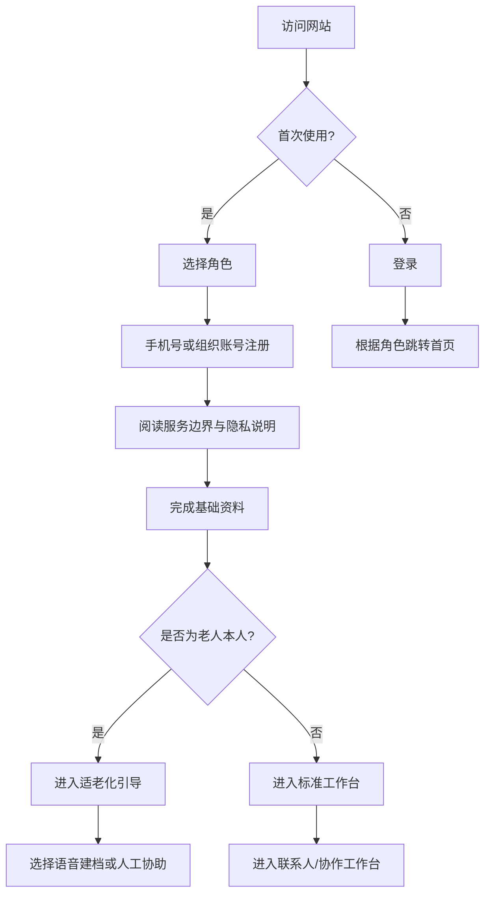
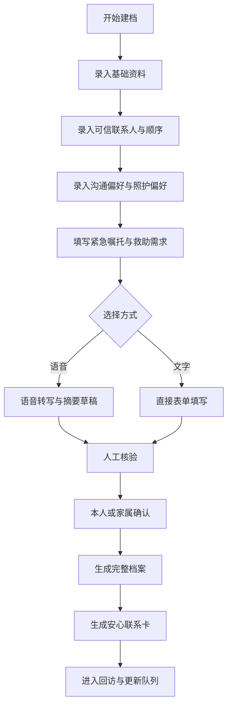
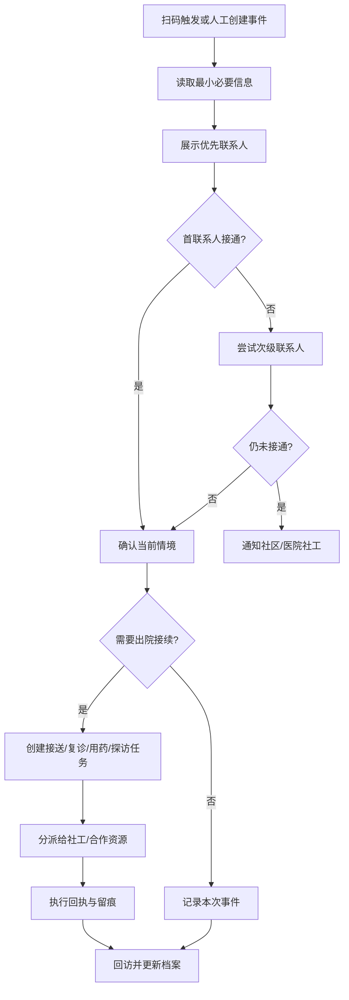
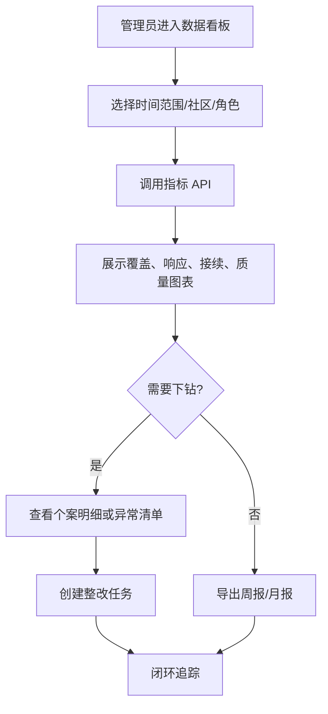
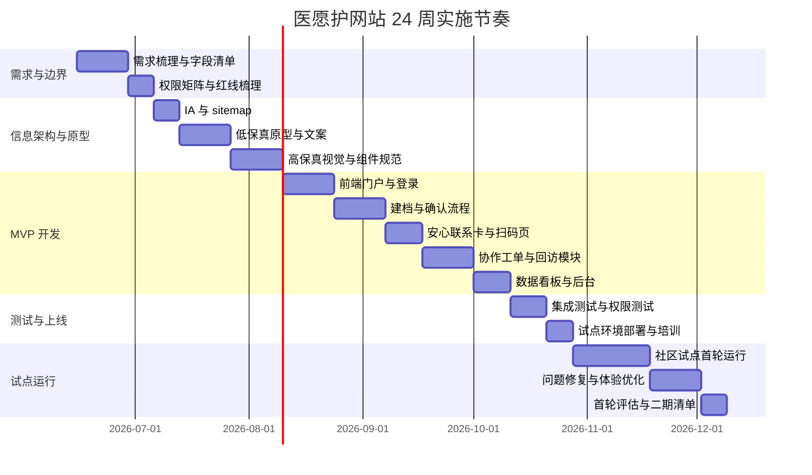

# “医愿护”大创项目网站设计深度研究报告

## 执行摘要

依据你们的项目策划书，“医愿护”并不是医院 HIS/EMR，也不是法律文书平台，而是一个以“AI连接人、不替人做决定”为边界、面向独居、空巢、留守、高龄慢病及低收入老人的“医疗意愿建档 + 急救联系 + 出院照护接续”公益系统。项目已经明确提出“一档案、一张卡、一摘要、一响应、一接续”的服务体系，并计划先用低成本 MVP 在社区试点中跑通“建档—发卡—扫码—联系—响应—照护—回访”的闭环。换言之，最合适的网站形态不是单一宣传官网，而是“公益门户 + 适老建档入口 + 多角色协作工作台 + 数据治理后台”的复合型网站。 fileciteturn0file0

对开发来说，我建议你把网站设计成一个**移动优先、桌面可管理、权限分层、纸卡可联动**的平台：老人侧入口尽量轻，家属/社区/志愿者/医院社工侧入口尽量流程化，管理员侧入口尽量可审计、可统计、可追踪。项目策划书已经明确首阶段重点服务约 100 名老人、试点期 6 个月、首阶段预算约 7.4 万—12.5 万元，因此网站方案也应优先覆盖七个已定义的 MVP 模块，而不是一开始追求“大而全”的医疗平台。 fileciteturn0file0

从产品落地角度看，最优方案是把网站拆成四个表层：**公共门户**负责项目展示与招募；**档案中心**负责老人建档、意愿摘要、安心联系卡；**协作工作台**负责联系人管理、应急触发、出院接续、工单流转；**管理与数据后台**负责权限、留痕、质控、看板与评估。这种结构既贴合策划书中的公益服务闭环，也能复用成熟的企业级 Web 模式与中文设计系统。Next.js 官方文档已提供认证、国际化、自托管与测试等能力入口；Ant Design 及其生态提供企业级组件、后台模板、首页模板与脚手架；ECharts 则适合做服务量、响应率、回访率、风险分层等图表看板。 citeturn7view0turn26view0turn26view1turn26view2turn26view3turn27view0turn27view2turn27view3turn9view2

## 项目解读与边界假设

你在文字里说“项目领域、目标用户、功能需求、数据类型、隐私安全、时间线、预算等未提供”，但实际上这些信息在策划书里已经相当明确；真正未明确的，是**网站实施层**的若干工程参数，例如是否对接医院系统、是否采用短信还是企业微信通知、是否同步做小程序、是否在中国大陆云上部署、是否启用实名校验等。下面这张表把“策划书已知”“本报告采用的设计假设”“仍待确认”的边界分开。 fileciteturn0file0

| 维度 | 策划书已知 | 本报告采用的设计假设 | 仍待开发前确认 |
|---|---|---|---|
| 项目领域 | AI 赋能独居长者医疗意愿建档与照护接续公益系统 | 网站是主入口之一，承担服务编排与协作，而非诊疗系统 | 是否同步做微信小程序/公众号服务号 |
| 核心人群 | 65 岁以上、独居/空巢/留守、缺少稳定照护支持、慢病/高龄/低收入老人优先 | 老人本人不是高频复杂操作用户，日常主操作者更多是家属、社区、志愿者 | 是否要覆盖非老年家属用户的高频自助操作 |
| 产品主线 | 一档案、一张卡、一摘要、一响应、一接续 | 网站按这五条主线组织 IA 与导航 | 是否还需加入知识库、培训、捐赠、活动等公益运营模块 |
| MVP | 老人建档、急救卡生成、联系人管理、应急响应、照护接续、救助材料生成、后台管理 | 首期只做这七块 + 必要可视化 | 是否在一期即接入医院/护理机构外部系统 |
| AI 定位 | 语音转写、信息整理、摘要生成、风险提示、服务匹配；不诊断、不代签、不替代监护/授权 | AI 仅做辅助生成与提醒，必须人工复核和版本留痕 | 是否采用第三方语音服务，还是校内/本地模型 |
| 时间与预算 | 6 个月社区试点，约 100 名老人；首阶段预算约 7.4 万—12.5 万元；首年目标约 500 名服务对象 | 网站分阶段建设：先 MVP，再增强协作与数据层 | 团队真实可用开发人力、UI 人力、测试人力 |
| 安全与合规 | 最小必要采集、分层授权、操作留痕、反诈红线、不接触财产 | 采用高敏数据治理思路设计字段与权限 | 是否需要进行校内伦理审批、数据脱敏审计、备案与等保准备 |

这意味着：**你的网站不该被设计成“看起来像互联网医疗问诊平台”**。更准确的产品定义应是：一个把老人平时的意愿与联系人信息，在突发入院和出院接续时“可见、可触达、可派单、可跟踪”的公益协作平台。策划书已经明确，平台不应进入医疗决定链，也不应代签、代诊断、代替依法有权主体作决定；网站的信息架构、按钮文案、角色权限与免责声明都必须围绕这一边界来组织。 fileciteturn0file0

## 用户角色与功能规划

### 用户角色与画像

建议把网站角色控制在六类，既能覆盖策划书中的参与方，又不会导致权限体系过于复杂。下面的画像已经足以支撑原型与数据库设计。 fileciteturn0file0

| 角色 | 典型画像 | 主要目标 | 主要痛点 | 网站重点页面 |
|---|---|---|---|---|
| 老人本人 | 76 岁独居慢病老人，手机能力弱，表达慢，担心突发住院后“没人知道” | 低门槛建档、留下可信联系人与照护偏好、拿到安心联系卡 | 不会打字、怕填表、怕泄露隐私、不理解法律边界 | 建档页、确认页、安心联系卡页、大字版说明页 |
| 家属/可信联系人 | 异地子女或常联系亲友，平时不在身边 | 接收通知、查看已授权摘要、协助确认信息、安排照护 | 通知延迟、联系人顺序混乱、无法快速了解老人偏好 | 登录/验证页、联系人页、个案页、任务页 |
| 社区/社工/志愿者 | 网格员、社工、志愿者，是建档与回访主力 | 完成建档、核验联系人、回访、派单、记录服务过程 | 信息分散、流程不清、责任边界不明、留痕困难 | 协作工作台、建档审核页、工单页、回访页 |
| 医院社工/出院协调人员 | 突发入院或出院前协同者 | 快速查看必要信息、联系责任人、发起出院接续 | 很难立即读完整档案、联系不到家属、出院后没人接续 | 安心联系卡扫码页、摘要页、出院接续页 |
| 护理/公益合作资源方 | 护工、接送、心理回访、救助协作组织 | 接收明确任务、回传执行结果 | 任务信息不标准、重复沟通、责任边界模糊 | 任务详情页、排班页、回执页 |
| 平台管理员/督导 | 项目负责人、质控负责人 | 权限配置、异常审计、数据看板、资金与成效评估支持 | 越权风险、信息过期、数据统计分散 | 后台管理、日志审计、数据看板、配置中心 |

从画像上看，**真正的“主操作用户”并不是老人，而是家属、社区、社工、志愿者与管理员**；老人更像“低频确认 + 高价值受益者”。因此，你的网站在视觉与流程上要采用“双轨体验”：老人看到的是大字、少步骤、可语音、可打印、可人工辅助；协作者看到的是卡片化任务、状态流转、留痕与过滤器。这与策划书强调的“除线上建档外，还要保留纸卡、电话、社区服务站协助”等低门槛原则一致。 fileciteturn0file0

### 功能清单与优先级

下面的功能清单把策划书中的服务闭环转译成网站可交付功能，并区分 MVP 与后续阶段。MVP 的核心原则只有一句话：**先跑通真实服务闭环，再扩展内容运营和高级智能能力**。 fileciteturn0file0

| 功能域 | 具体功能 | 主要角色 | MVP | 后续阶段 |
|---|---|---|---|---|
| 公益门户 | 项目介绍、服务边界、案例故事、加入我们、联系方式 | 全部 | 是 | 持续增强 |
| 适老建档 | 文字建档、语音建档、人工录入、草稿保存 | 老人/社区/志愿者 | 是 | 持续增强 |
| 知情确认 | 大字版同意说明、语音版说明、本人/家属确认、版本留痕 | 老人/家属/社区 | 是 | 持续增强 |
| 联系人管理 | 多联系人、优先级排序、联系人验证、失效提醒 | 家属/社区 | 是 | 持续增强 |
| 意愿摘要 | 一键生成摘要、人工修订、摘要确认、打印导出 | 社区/家属/医院社工 | 是 | 持续增强 |
| 安心联系卡 | 生成二维码卡、打印版式、挂失/换发、公开级别设置 | 社区/管理员 | 是 | 持续增强 |
| 扫码应急页 | 紧急信息最小展示、联系人顺序、快速拨号/通知 | 医院社工/社区/家属 | 是 | 持续增强 |
| 应急响应 | 触发事件、自动生成协作任务、状态跟踪、异常上报 | 社区/管理员 | 是 | 持续增强 |
| 出院接续 | 出院接送、复诊提醒、用药提醒、探访安排、资源转介 | 社区/合作方 | 是 | 持续增强 |
| 救助支持 | 材料清单、补贴线索、公益资源登记 | 社区/社工 | 是 | 持续增强 |
| 回访管理 | 电话回访、任务提醒、满意度记录、档案更新 | 社区/志愿者 | 是 | 持续增强 |
| 数据看板 | 建档量、发卡量、联系人有效率、响应率、回访率 | 管理员/督导 | 是 | 持续增强 |
| 审计与权限 | RBAC、查看留痕、异常导出告警、访问日志 | 管理员 | 是 | 持续增强 |
| 培训中心 | 志愿者上岗规则、服务红线、标准话术 | 社工/志愿者 | 否 | 二期 |
| 消息中心 | 短信/电话/企微/邮件多通道通知 | 全部 | 否 | 二期 |
| 外部对接 | 医院社工系统、社区系统、护理资源 API | 管理员/合作方 | 否 | 二期 |
| 高级 AI | 方言增强、冲突检查、智能复访建议、多维风险预测 | 管理员/社工 | 否 | 三期 |
| 资源运营 | 志愿者报名、捐赠入口、活动发布、品牌传播 | 社会公众 | 否 | 三期 |

这里特别建议你把“用户要求中的 project submission”在本项目语境下**映射为“老人档案/服务个案提交”**，而不是做成传统赛事式“项目申报”。因为你们网站的核心任务不是收集团队项目书，而是收集老人个案与服务需求。这个映射和策划书的服务闭环是完全一致的。 fileciteturn0file0

## 信息架构与页面原型

### 信息架构与站点地图

建议采用“四层 IA”：**公共层、服务层、协作层、治理层**。这样既能让外部访客迅速理解项目，又能让不同角色登录后进入各自的工作面板。下面是适合首版开发的站点地图。 

| 一级栏目 | 二级页面 | URL 建议 | 面向角色 | 核心内容 | MVP |
|---|---|---|---|---|---|
| 首页 | 公益门户首页 | `/` | 全部 | 项目价值、行动入口、最新动态 | 是 |
| 项目说明 | 项目简介 | `/about` | 全部 | 一档案一张卡一摘要一响应一接续 | 是 |
| 项目说明 | 服务边界 | `/boundary` | 全部 | 不代签、不诊断、不接触财产 | 是 |
| 项目说明 | 常见问题 | `/faq` | 全部 | 隐私、授权、使用方式 | 是 |
| 服务入口 | 立即建档 | `/intake/start` | 老人/家属/社区 | 建档引导、选择代办方式 | 是 |
| 服务入口 | 语音建档 | `/intake/voice` | 老人/社区 | 录音、转写、核验 | 是 |
| 服务入口 | 信息确认 | `/intake/confirm` | 老人/家属 | 最终确认、签署同意 | 是 |
| 服务入口 | 安心联系卡 | `/card/{id}` | 老人/社区 | 卡片预览、打印、挂失 | 是 |
| 服务入口 | 扫码应急页 | `/emergency/{token}` | 医院社工/社区/家属 | 最小必要信息与联系动作 | 是 |
| 协作工作台 | 我的任务 | `/workspace/tasks` | 社工/志愿者/合作方 | 待办、已办、超时任务 | 是 |
| 协作工作台 | 个案中心 | `/workspace/cases` | 社工/管理员 | 个案检索、标签、状态流转 | 是 |
| 协作工作台 | 出院接续 | `/workspace/discharge` | 社工/合作方 | 接送、复诊、用药、探访安排 | 是 |
| 协作工作台 | 回访中心 | `/workspace/followups` | 社工/志愿者 | 回访列表、满意度、更新提醒 | 是 |
| 数据中心 | 运营看板 | `/dashboard/overview` | 管理员 | KPI、趋势图、分社区统计 | 是 |
| 数据中心 | 质量与审计 | `/dashboard/audit` | 管理员 | 异常访问、越权、日志 | 是 |
| 管理后台 | 用户与角色 | `/admin/users` | 管理员 | RBAC、组织管理、启停账号 | 是 |
| 管理后台 | 配置中心 | `/admin/settings` | 管理员 | 字段配置、公开级别、文案配置 | 是 |
| 管理后台 | 模板中心 | `/admin/templates` | 管理员 | 摘要模板、卡片模板、通知模板 | 否 |
| 资源中心 | 培训与规范 | `/resources/training` | 志愿者/社工 | 红线规则、流程手册 | 否 |
| 资源中心 | 公益资源库 | `/resources/providers` | 社工/合作方 | 护理、法律、慈善、社区资源 | 否 |

这套 IA 与策划书的逻辑高度一致：前台负责“理解与进入”，服务层负责“建档与卡片”，协作层负责“事件与任务”，治理层负责“权限、留痕、评估”。如果你需要现成的中文企业级模式，可直接参考 Ant Design、Ant Design Pro、Ant Design Landing 与 Ant Design Scaffolds 的页面结构；看板则可直接参考 ECharts 的图表模式与示例。 citeturn27view0turn27view2turn27view3turn9view2

### 关键页面与线框说明

下面给出最值得先画低保真的五个页面。它们足以覆盖项目的大部分功能。

#### 首页公益门户

```text
┌ 顶部导航：项目说明｜立即建档｜协作工作台｜数据看板｜登录 ┐
│ 大字版｜高对比度｜服务热线｜简体中文                         │
├ 主视觉标题                                                      ┤
│ 让老人关键时刻有人联系、信息可查、照护可接                    │
│ [立即建档] [了解项目边界] [查看示例卡]                         │
├ 五大能力卡片                                                    ┤
│ 一档案｜一张卡｜一摘要｜一响应｜一接续                        │
├ 使用场景                                                        ┤
│ 突发入院｜住院沟通｜出院接续｜回访更新                        │
├ 公益说明与边界                                                  ┤
│ 不代签｜不诊断｜不接触财产｜只做信息支持与照护接续            │
└ 页脚：合作社区｜联系方式｜隐私说明｜志愿者入口                ┘
```

**示例文案**：  
主标题可写成“让老人关键时刻有人联系、信息可查、照护可接”；副标题可写成“医愿护以 AI 辅助建档、应急联系与出院接续，不替代医生决策，不替代依法有权主体签署。”这样既突出价值，也把合规边界前置。 fileciteturn0file0

#### 建档与确认页

| 区块 | 组件建议 | 说明 | 示例内容 |
|---|---|---|---|
| 基本信息 | 分步表单 + 大按钮 + 语音录入按钮 | 只保留服务必需字段 | 姓名、年龄段、社区、独居状态 |
| 可信联系人 | 可排序列表 + 验证状态 Tag | 必须支持优先级排序 | “优先联系女儿李某；其次联系社区网格员王某” |
| 沟通与照护偏好 | 单选/多选 + 文本补充 | 用自然语言替代专业术语 | “希望由谁协助沟通”“出院后更希望回家休养” |
| 紧急嘱托与救助需求 | 文本框 + 语音转写 | 支持先说后改 | “担心费用，如需要长期护理，希望协助了解救助政策” |
| 确认页 | 摘要预览 + 勾选确认 + 版本号 | AI 草稿必须人工确认 | “本人已阅读并确认以上内容” |

这一页的关键不是“把表单做完整”，而是“把策划书中的六类核心内容——可信联系人、联系顺序、沟通偏好、照护偏好、紧急嘱托、救助需求——做得极易填写、极易核验”。 fileciteturn0file0

#### 安心联系卡页

```text
┌ 卡片预览 ┐   ┌ 权限设置 ┐
│ 姓名      │   │ 公开级别：扫码仅显示必要信息 │
│ 社区      │   │ 联系人详情：需二次验证       │
│ 紧急提示  │   │ 完整档案：仅社区/管理员可见 │
│ QR 码     │   └───────────────────────────┘
└──────────┘
[打印 PVC 版] [下载纸质版 PDF] [挂失] [重新生成]
```

**设计要点**：卡片正面只放必要信息，背后由二维码承载可授权扩展信息；绝不能把完整隐私直接印在卡上。策划书已经明确“卡片不展示过多隐私，只提供紧急联系和照护协助所必需的信息”，因此公开页、二次验证页和完整档案页必须分层。 fileciteturn0file0

#### 协作工作台

```text
┌ 顶部：今日待办 12｜超时 3｜新应急 1｜待回访 8 ┐
├ 左侧筛选：社区 / 风险标签 / 状态 / 负责人 / 时间 ┤
├ 主列表：个案卡片                                    ┤
│ 张奶奶｜应急扫码触发｜需联系女儿 + 社区介入        │
│ 李爷爷｜出院接续｜待安排复诊提醒                    │
├ 右侧详情面板                                        ┤
│ 摘要｜联系人｜任务流转｜留痕｜附件                 │
└ 底部动作：[创建任务] [转派] [完成回访] [标记异常] ┘
```

这一页建议直接借鉴 Ant Design Pro 的后台信息结构：顶部 KPI + 左侧过滤 + 中间列表 + 右侧详情抽屉/侧栏，是最适合社工与管理员高频处理工单的模式。Ant Design 官方首页已把 Ant Design Pro、Pro Components、Landing、Scaffolds 作为成套生态提供；对你来说，这比从零发明后台模式更高效。 citeturn27view0turn27view3

#### 数据看板

| 模块 | 图表建议 | 指标示例 |
|---|---|---|
| 服务覆盖 | 柱状图/折线图 | 建档数、发卡数、活跃个案数 |
| 联系有效性 | 漏斗图/条形图 | 联系人验证率、首联系人接通率 |
| 响应效率 | 折线图/箱线图 | 应急触发到首响应时长、中位数 |
| 出院接续 | 堆叠柱状图 | 接送完成率、回访率、复诊提醒完成率 |
| 风险分层 | 饼图/矩阵图 | 高关注/中关注/待核验人数 |
| 质量治理 | 表格 + Tag | 越权访问、超时任务、信息过期档案 |

Apache ECharts 官方中文站明确支持 20 多种图表、数据集管理、响应式设计和无障碍访问；这正适合本项目的运营统计和适老展示场景。 citeturn9view2

## 核心交互流程

以下四个流程把你要求的“registration, project submission, collaboration, data visualization”落到本项目语境中。需要说明的是，这里的 **project submission 已映射为“老人档案/服务个案提交”**。流程逻辑与策划书中的“建档—发卡—扫码—联系—工单—回访”闭环一致。 fileciteturn0file0

### 注册与授权流程



### 老人档案与个案提交流程



### 协作派单与照护接续流程



### 数据可视化查看流程



## 技术架构与数据设计

### 推荐技术栈

我建议采用**“Next.js + Ant Design + NestJS + PostgreSQL + Keycloak + ECharts + GitHub Actions”**这一套相对稳、中文资料友好、适合学生团队持续维护的组合。Next.js 官方文档已经提供认证、国际化、自托管与测试入口；NestJS 强调高效、可扩展、可维护的服务端架构；PostgreSQL 在文档中明确覆盖数据类型、客户端认证、数据库角色、备份恢复与高可用复制；Keycloak 提供 OpenID Connect、安全应用接入、细粒度授权、管理 REST API 与本地化能力；ECharts 适合复杂数据看板；GitHub Actions 适合自动化 CI/CD。 citeturn7view0turn8view1turn25view0turn25view2turn25view3turn30view0turn30view1turn30view2turn9view2turn9view3

| 技术层 | 推荐选择 | 为什么适合你们 | 主要代价 | 成本判断 |
|---|---|---|---|---|
| 前端框架 | Next.js + TypeScript | 适合门户 + 工作台 + SSR/静态页面混合 | 框架更新快，需控制复杂度 | 低到中 |
| UI 体系 | Ant Design + Pro Components | 中文生态成熟，表单、表格、权限后台很强 | 设计风格偏企业后台，需做适老化定制 | 低 |
| 数据可视化 | Apache ECharts | 图表类型丰富、响应式、支持无障碍 | 配置较长，需封装公共组件 | 低 |
| 后端 | NestJS | 模块化清晰，适合多角色、多流程、多接口 | 初期样板代码较多 | 低到中 |
| 数据库 | PostgreSQL | 关系模型强，适合档案、日志、任务、授权 | 运维上比 SQLite 更正式 | 低到中 |
| 认证与授权 | Keycloak | OIDC/SAML/细粒度授权/本地化/管理 API 完整 | 独立服务运维成本更高 | 中 |
| 文件存储 | 对象存储或 MinIO | 适合音频、PDF 卡片、附件、导出报表 | 需要生命周期与访问控制 | 低到中 |
| 部署方式 | 自托管到校内服务器或中国大陆云主机 | 便于控制敏感数据与访问边界 | 需要备案/运维/备份安排 | 中 |
| CI/CD | GitHub Actions + Docker | 可自动测试、构建、部署 | 私有 Runner 管理要投入 | 低到中 |

如果只是做校内演示版，可以先把 Keycloak 简化为基本登录体系，把通知简化为站内提醒和电话人工触达；如果要进入真实社区试点并保存老人身份/健康等信息，则应尽量使用**中国大陆可控环境、自托管部署、分层权限与严格审计**，因为《个人信息保护法》已将医疗健康等列为敏感个人信息。 citeturn15search4turn26view2turn30view0

### 成本分层建议

策划书给出的首阶段预算已经很明确，因此网站技术方案也应采用成本分层，而不是“全功能一次到位”。 fileciteturn0file0

| 版本 | 适用场景 | 组件配置 | 建议 |
|---|---|---|---|
| 演示验证版 | 校内展示、答辩 | 单环境部署、基础登录、手动通知、少量示例数据 | 最快做出可演示原型 |
| 社区试点版 | 6 个月、100 名老人试点 | 正式数据库、对象存储、审计日志、打印卡片、任务流转、基础看板 | 这是你当前最该瞄准的版本 |
| 多社区协同版 | 500 人以上、多个社区 | 独立认证中心、多组织权限、短信/企微通知、资源方接入、监控告警 | 作为二期目标 |
| 合规强化版 | 与真实机构长期合作 | 双环境、备份恢复演练、WAF、细粒度授权、异常检测、留痕审计 | 作为长期治理目标 |

### 数据模型建议

下面的数据模型已经足以支撑你的网站绝大多数功能。注意：字段设计要始终服从“最小必要采集”和“公开级别分层”。 fileciteturn0file0turn15search4

| 实体 | 关键字段 | 说明 |
|---|---|---|
| User | id, name, phone, role, org_id, status, accessibility_prefs | 平台用户与角色 |
| Organization | id, type, name, community_code, contact_phone | 社区/医院/公益机构/学校团队 |
| ElderProfile | id, name, gender, age_range, living_status, address, community_id, profile_status | 老人主档 |
| TrustedContact | id, elder_id, name, relation, phone, priority, verified_status | 可信联系人与顺序 |
| ConsentRecord | id, elder_id, consent_scope, consent_method, confirmed_by, confirmed_at, evidence_uri | 知情同意与授权留痕 |
| CarePreference | id, elder_id, communication_pref, discharge_pref, emergency_note, aid_need | 沟通偏好、照护偏好、紧急嘱托 |
| SummaryRecord | id, elder_id, ai_draft, human_revision, final_text, version_no, confirmed_at | 意愿摘要与版本控制 |
| EmergencyCard | id, elder_id, card_no, qr_token, visibility_level, printed_at, status | 安心联系卡 |
| CaseEvent | id, elder_id, trigger_type, trigger_time, source, severity_label, status | 应急事件/个案流转 |
| CareTask | id, case_id, task_type, assignee_id, due_at, status, completion_note | 协作工单 |
| DischargePlan | id, elder_id, case_id, pickup_need, medication_reminder, revisit_plan, visit_plan | 出院接续计划 |
| ResourceProvider | id, type, org_name, service_scope, available_area, active_status | 护理/公益/法律等资源方 |
| FollowupRecord | id, elder_id, case_id, followup_type, result, satisfaction_score, next_action | 回访记录 |
| AuditLog | id, actor_id, action, resource_type, resource_id, ip, created_at | 操作留痕 |
| DashboardSnapshot | id, date, community_id, metric_key, metric_value | 报表与缓存指标 |

### API 端点建议

建议采用 `/api/v1` 风格的 REST API，前期足够清晰；等到跨机构协同复杂了，再考虑事件总线或更细的 BFF。下面是首版推荐端点。 

| 方法 | 端点 | 用途 | 主要角色 |
|---|---|---|---|
| POST | `/api/v1/auth/login` | 登录 | 全部 |
| GET | `/api/v1/me` | 获取当前用户与权限 | 全部 |
| POST | `/api/v1/elders` | 新建老人档案 | 社区/志愿者/管理员 |
| GET | `/api/v1/elders/{id}` | 查看老人档案 | 有权限角色 |
| PATCH | `/api/v1/elders/{id}` | 更新老人档案 | 社区/管理员 |
| POST | `/api/v1/elders/{id}/contacts` | 添加联系人 | 社区/家属 |
| PATCH | `/api/v1/contacts/{id}/priority` | 调整联系人顺序 | 社区/家属 |
| POST | `/api/v1/elders/{id}/consents` | 记录知情同意 | 社区/家属 |
| POST | `/api/v1/elders/{id}/summary/generate` | 生成 AI 摘要草稿 | 社区/管理员 |
| PATCH | `/api/v1/summaries/{id}/confirm` | 确认最终摘要版本 | 老人/家属/社区 |
| POST | `/api/v1/cards` | 生成安心联系卡 | 社区/管理员 |
| GET | `/api/v1/cards/{token}/public` | 扫码后展示最小必要信息 | 应急查看者 |
| POST | `/api/v1/cases` | 创建服务个案/事件 | 社区/医院社工 |
| POST | `/api/v1/cases/{id}/trigger` | 触发应急流程 | 社区/医院社工 |
| POST | `/api/v1/tasks` | 创建协作任务 | 社区/管理员 |
| PATCH | `/api/v1/tasks/{id}` | 更新任务状态 | 社工/合作方 |
| POST | `/api/v1/discharge-plans` | 创建出院接续计划 | 社区/医院社工 |
| POST | `/api/v1/followups` | 新增回访记录 | 社工/志愿者 |
| GET | `/api/v1/dashboard/kpis` | 获取关键指标 | 管理员 |
| GET | `/api/v1/audit-logs` | 获取审计日志 | 管理员 |

## 无障碍与本地化设计

适老化不是把字体放大这么简单，而是要把**信息可感知、操作可完成、流程可理解、结果可回顾**做成默认能力。WCAG 2.2 是当前 W3C 推荐使用的无障碍标准，围绕可感知、可操作、可理解、稳健四大原则组织；ARIA Authoring Practices Guide 则提供了常见组件与键盘交互模式。Apache ECharts 官方也强调了图表描述与贴花等无障碍能力。 citeturn13view0turn13view1turn9view2

建议你的网站至少实现以下适老化与本地化能力：

| 设计维度 | 建议做法 | 为什么重要 |
|---|---|---|
| 视觉 | 默认 16–18px 正文字号，提供“大字版/高对比度”开关 | 老年视力下降是常见场景 |
| 文案 | 尽量少术语、少长句，避免“授权链、诊疗同意”等抽象词不解释 | 降低理解门槛 |
| 输入 | 所有核心表单都提供“语音录入 + 人工辅助 + 分步填写” | 策划书已明确照顾不会写字、不会用手机的老人 |
| 导航 | 一级导航不超过 5 个；关键操作固定按钮；重要入口始终可见 | 防止迷路 |
| 反馈 | 每一步都显示“已保存/待确认/已完成”状态 | 降低焦虑感 |
| 图表 | 为图表提供文字摘要与表格切换 | 并非所有用户善于读图 |
| 打印 | 摘要页、联系卡页、知情说明页都支持打印 | 纸质场景是项目刚需 |
| 语言 | 简体中文为默认；保留后续方言说明/普通话释义字段 | 适配真实社区场景 |
| 国际化 | 前端支持 locale、后台支持词条本地化 | 便于后续扩展和统一术语 |

从技术上看，Next.js 文档明确提供国际化入口，Keycloak 也提供 UI localization 能力，因此中文优先、术语统一、后续可扩语言包的实现门槛并不高。 citeturn26view1turn30view0

## 安全隐私与合规建议

这一部分必须严格，因为你们项目涉及老人身份、健康、联系人、经济困难与照护偏好等高敏信息。策划书已经把“六不原则”“信息支持链与医疗决策链分离”“最小化采集、分层授权、操作留痕、反诈保护”写得非常清楚；再结合《个人信息保护法》对医疗健康等敏感个人信息的界定，以及 W3C/OWASP 对安全与可访问开发的要求，网站应从一开始就按“高敏公益系统”来设计，而不是普通内容站。 fileciteturn0file0turn15search4turn13view0turn29view0

建议落实成以下可执行规则：

| 主题 | 必做建议 | 来源依据 |
|---|---|---|
| 数据最小化 | 只采集服务所必需字段；把“想知道的一切”改成“服务必需项 + 可选项” | 策划书、PIPL |
| 分层授权 | 扫码公开页只显示最小必要信息；联系人详情需二次验证；完整档案仅内部角色可见 | 策划书 |
| 同意机制 | 知情说明提供大字版、语音版、面对面讲解记录；确认时间、方式、版本留痕 | 策划书 |
| AI 复核 | AI 只能生成草稿与提醒；必须人工核验、本人或家属确认；保留版本历史 | 策划书 |
| 红线限制 | 页面文案和操作中显式禁止代签、代诊断、代作医疗决定、接触财产 | 策划书 |
| 审计日志 | 查看、修改、导出、删除、扫码、任务流转都留痕；异常访问自动告警 | 策划书 |
| 前端安全 | 站点启用 HTTPS、CSP、表单校验、最少第三方脚本、敏感页禁索引 | W3C/web.dev |
| 开发基线 | 以 OWASP ASVS 作为安全验收清单基础，重点看认证、授权、输入校验、日志、加密 | OWASP |
| 存储策略 | 音频、导出文件、卡片 PDF 单独存储；设置过期策略与访问签名 | 工程建议 |
| 反诈保护 | 平台没有任何金融营销入口；银行/保险只能在公益与保障范围协同 | 策划书 |

Content Security Policy 可以显著降低 XSS 风险；OWASP ASVS 则可作为你们验收 Web 安全控制与安全开发要求的基准。对你们这种既有表单、又有后台、又有二维码外链页面的系统，这两项尤其重要。 citeturn28view0turn28view3turn29view0

## 测试 部署 维护与参考来源

### 测试策略

Next.js 文档已经把 Jest、Playwright、Cypress、Vitest 等测试入口列为官方指南内容，因此你们完全可以用“单元 + 集成 + E2E + 无障碍 + 权限安全”的五层测试法，而不需要从零摸索。 citeturn26view3

| 测试层 | 重点对象 | 通过标准 |
|---|---|---|
| 单元测试 | 表单校验、联系人排序、权限判断、摘要版本逻辑 | 核心服务函数覆盖率达标 |
| 集成测试 | 建档到发卡、扫码到派单、回访到更新 | 关键链路无阻断 |
| E2E 测试 | 登录、建档、打印卡片、任务流转、导出报表 | 核心任务可完整走通 |
| 无障碍测试 | 键盘导航、可读标签、对比度、图表文字摘要 | 满足 WCAG AA 的关键项 |
| 安全测试 | 越权访问、IDOR、导出限制、审计日志、CSP | 无高危漏洞上线 |
| 试点验收 | 真实社区用户可理解、可完成、愿意使用 | 访谈 + 完成率 + 满意度达标 |

### 部署与维护节奏

下面给出一个与策划书节奏相匹配、又适合网站开发的 24 周实施方案。前 16 周把 MVP 做完，后 8 周进入试点运行与迭代更合适。开发时间可以与你们项目原本的“前期调研—建档发卡—系统运行”阶段并行衔接。 fileciteturn0file0



维护上，建议至少建立三类例行机制：  
其一，**每周例会**，处理工单、异常、用户反馈；  
其二，**每月复盘**，看建档数量、首联系人接通率、回访率、信息过期率；  
其三，**每季度治理审查**，检查权限、日志、导出、告警、备份恢复与合规文案是否仍然有效。这个节奏与策划书中的月度台账、中期复盘、试点期成效报告是匹配的。 fileciteturn0file0

### 优先参考的站点与资料

真正对你这次网站设计最有帮助的资料，不是随便找几个“养老网站”，而是优先看**项目策划书本身 + 官方设计系统 + 官方技术文档 + 少量相关研究**。我建议按下面的优先级使用：

**最高优先级**  
项目策划书本身，用来确定业务边界、角色、模块、红线、阶段目标与预算，这是所有页面和数据库设计的源头。 fileciteturn0file0

**产品与界面模式优先级**  
Ant Design 生态最适合做你的中文门户与后台：Ant Design 提供设计语言、组件与设计指引；官方首页还直接列出了 Ant Design Pro、Ant Design Landing、Scaffolds 和 Ant Design Mobile，适合分别参考后台工作台、门户首页模板、脚手架与移动端界面模式。ECharts 适合做运营看板与服务统计图表。 citeturn27view0turn27view2turn27view3turn9view2

**技术实现优先级**  
Next.js 文档适合前端路由、自托管、认证、国际化与测试；NestJS 适合后端服务与模块化架构；PostgreSQL 适合角色、认证、备份与复制；Keycloak 适合 OIDC、细粒度权限、管理 API 与本地化；GitHub Actions 适合自动化 CI/CD。 citeturn7view0turn8view1turn25view0turn25view2turn25view3turn30view0turn30view1turn30view2turn9view3

**无障碍与安全优先级**  
W3C WCAG 2.2、WAI-ARIA APG、OWASP ASVS 与 CSP 指南，是你们做“适老化 + 高敏数据 Web”时最该直接映射到验收项的资料。 citeturn13view0turn13view1turn29view0turn28view3

**方法论与研究参考**  
如果要写答辩材料或设计说明，可参考老年人从住院到回家过渡干预研究、关于中国中老年数字排斥的研究，以及老年人电子健康界面交互研究。需要注意，其中部分是预印本，更适合做方法启发，而不是合规依据。 citeturn22academia1turn22academia2turn22academia3

**与项目同构度较高的“参考类别”**  
策划书自己已经指出了最主要的对照对象：陪诊平台、社区帮扶项目、居家上门护理/家政照护，以及“一张卡”类信息工具。对网站设计而言，这意味着你应借鉴它们的“单次服务入口”和“联系人触达”，但不要把网站做成只解决“一次就医”的工具，而要坚持“平时建档—突发响应—出院接续”的连续闭环。 fileciteturn0file0

### 未决问题与限制

下面这些问题不影响你先画原型，但会影响开发排期和上线方式：

| 未决问题 | 影响 |
|---|---|
| 是否只做网站，还是网站 + 小程序 | 决定前端范围与成本 |
| 是否接入医院/社区现有系统 | 决定 API 设计复杂度 |
| 通知渠道是短信、电话、企微还是人工 | 决定消息中心方案 |
| 是否做实名校验与联系人真实性校验 | 决定认证与法律风险控制 |
| 扫码页的公开级别如何分层 | 决定卡片与权限设计 |
| 谁来承担持续录入与回访 | 决定协作台工作流设计 |
| 数据保存多久、何时归档/删除 | 决定数据库与合规策略 |
| 真实上线是否进入中国大陆云并办理备案 | 决定部署与运维路径 |

综合来看，你最应该设计的网站，不是一个“展示项目介绍的官网”，而是一个**以老人档案、安心联系卡、应急协作、出院接续和数据治理为核心的公益服务操作平台**；只要你围绕这个定位推进，网站就能覆盖项目的大部分功能，而且与策划书逻辑高度一致。 fileciteturn0file0